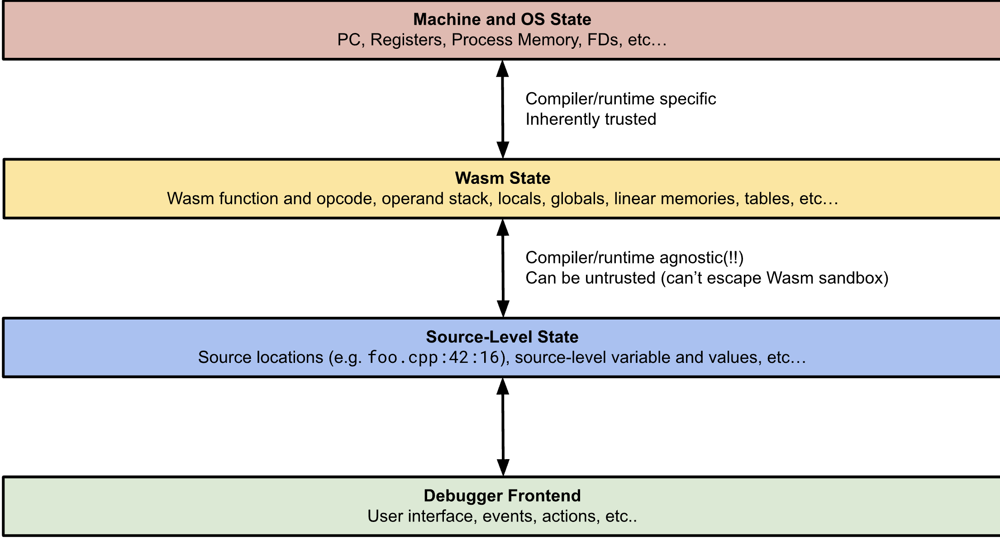

# February 09 SIG-Debugging Meeting

**See the [instructions](../README.md) for details on how to attend**

## Agenda

* Officially a SIG.
  * Chair: Nick Fitzgerald
* Discussion of the 
* Any or all of the arrows could be remote protocols
    * If the first arrow is remote, that lets platforms off load debugging symbols from the machines that run Wasm to secondary debugging-specific machines/locations
    * If the second arrow is remote, that lets Wasm authors avoid sharing debugging symbols about their code with the platform they are running on
    * The last arrow between the source state and the debugger frontend is most likely to be an existing protocol, assuming we won’t implement our own frontend.
* Wasm↔Source-level could be implemented by reading DWARF or via the debugger components we talked about last time

## Attendees

- Andrew Brown
- Ben Striegel
- Chris Fallin
- Jeff Charles
- jiazho
- Joel Dice
- Johnnie L. Birch
- Nick Fitzgerald
- Ralph Squillace
- Saúl Cabrera
- Till Schneidereit
- tnachen
- wilsonny371
- Jamey Sharp
- Luke Wagner

## Notes

* Recurring meeting time:
    * Attendees in CET timezone, so we need to figure out a good time and cadence.
    * Maybe an hour meeting every other week.
    * 8AM PST, 11 EST, every other week
* Continuing the discussion from last time: layered architecture
* Nick:
    * Translation from machine/os state to the debugger protocol (source level stuff).
    * Each of the arrows in the above diagram could represent remote protocols, and having remote protocols at each of these touch points could represent multiple advantages(e.g. separation of concerns).
    * Wasm State to Source State: if you're doing proprietary code, you're free not to share the debugging information, and keep it "local".
    * We can consider the "Debugger front-end" an external constraint. 
    * Properties of translation between stages:
    * Machine and OS to Wasm: compiler and runtime specific and a trusted operation.
    * Wasm to Source: Compiler runtime agnostic, trusted environment, given the Wasm sandbox. Could be implemented by reading Dwarf for example. (Different approaches).
* Andrew Brown: 
    * The chart comes from a translation idea. Do you see a debugging client able to see every level at the same time?
* Nick:
    * There's no reason why we couldn't. We are constrained by the protocol that we are using in the debugger front-end. And the other constraint is how much trust you have.
* Chris F:
    * Useful of hiding the machine state. Hiding the implementation details and only speaking in Wasm details. Why do you want to know what you have in R8?
* Nick:
    * This differs in perspectives (Cranelift hacker vs other uses).
* Andrew B: 
    * As a client, what can I possibly inspect? Client to machine, client to Wasm (a bit different than current diagram).
* Till:
    * Where do you see standardization efforts required here? Wasm state vs source level state?
    * How do you see these abstraction layers for languages running in VMs?
* Nick:
    * Standardized: Debugger component that exposes the Wasm content; split Wasm state or getting Wasm state from the runtime to be exposed to the debugger frontend.
    * It might be better to start with the known pieces and then standardize if needed. 
    * For interpreted languages: custom section with metadata on how to debug the module.
* Ulrich:
    * What is the big picture from an end user perspective?
    * I want to run all Wasmtime under gdb and debug everything (state, source code, etc). That would be the ideal experience of a Cranelift/Wasmtime developer.
* Nick:
    * We spent time talking about that during the last meeting.
    * We defined a cross-product according to the scenarios that we want to support.
* Chris F:
    * Meta question: what path are we going to take?
    * One: design the entire framework?
    * Two: design specific goals?
    * Might be useful to define specific goals and that might help derive the discussion.
* Jlbirch: 
    * We need an end goal to be able to have ideas that fit together.
    * General approach defining the entire framework and then implementing the pieces.
* Nick:
    * Many of the scenarios that we discussed last time have overlapping operations so we can take the common denominator of each and work from there. To avoid multiple implementations.
    * Unification: inspecting multiple levels could be additive, depending on what you want to expect.
* Ulrich:
    * This ties back to the end user experience. 
* Nick:
    * We need to do some of the latter (guest debugging mostly) since it's what doesn't really exist. 
* Ulrich:
    * Part of this is we don't write our own debugger, we use existing debugging tools, right?
* Till:
    * Collect real use cases?
    * Work from there backwards to inform where we start and have a clearer categorization.
    * As a wasmtime developer… 
    * As a JS developer… (debug JS code running in a VM running in Wasmtime).
    * As a user compiling a Rust program…
* Luke:
    * Debugging the entire system (e.g via gdb) is very different than the other options, where you debug in different layers.
* Chris F:
    * We would have a simpler system if we don't generate DWARF.
* Luke:
    * Pick a protocol (e.g. Chrome Debug Protocol, LSP)
    * Find an existing implementation that works natively
    * Port to Wasm
    * (Incremental approach to expose the Wasm state)
* Chris F:
    * +1 for the incremental approach.
* Ralph:
    * .NET implements multiple protocols
    * They translate between multiple protocols
    * The person who implemented it is available and could participate in this discussion.
* Luke:
    * Pick one or the other
    * Put us in a better place
* Ralph:
    * The Chrome protocol is not strictly open source; the team assumes that GDB is "canonical".
* Till:
    * Implications between components when choosing a protocol.
* Luke:
    * If protocol needs a stack trace, we don't know what happens if we switch languages (multiple components, multiple languages).
* Nick:
    * Assumptions of a single memory for example.
* Ulrich:
    * LLDB is pretty much equivalent to GDB
    * GDB itself constructs high level information from the low-level information (registers, memory)
* Chris F: 
    * Browser level seems a better fit, for the semantics of Wasm. We don't want to expose the machine internals (not necessarily).
* Jlbirch:
    * Can profilers inform some of our work / decisions here?
* Till:
    * Core dumps: tooling conventions. Evaluating supporting that in Wasmtime.

## Action Items

