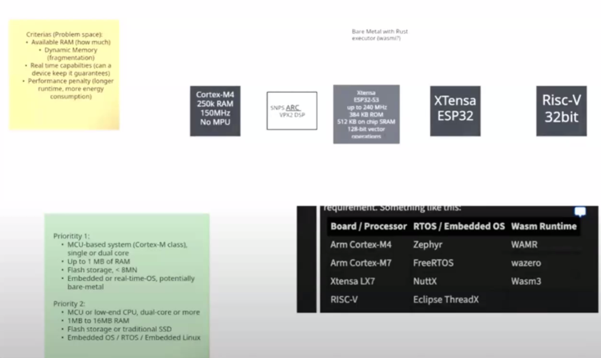
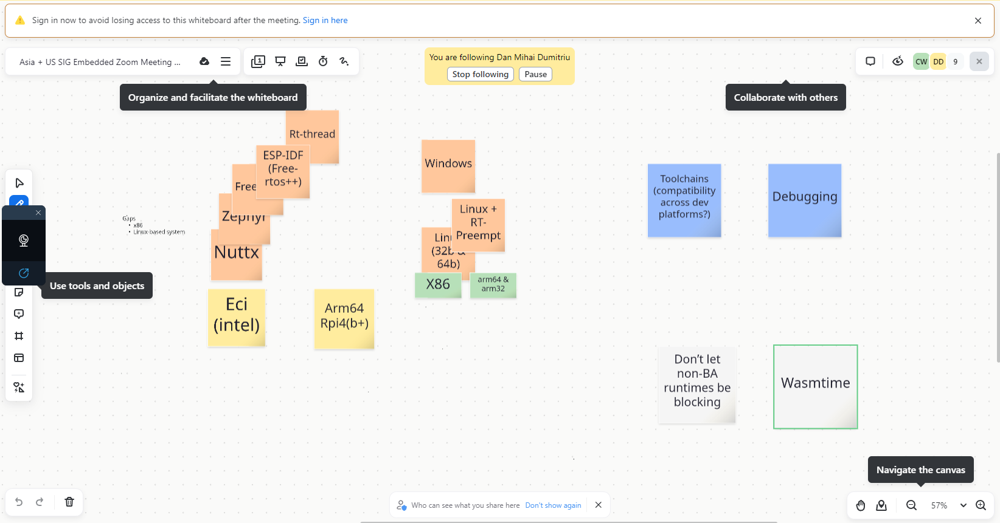

# July 09 SIG-Embedded Meeting
## Asia Pacific and US Timzone meeting
**8am China, 8pm US East Coast *$*, 7pm US Central *$*, 5pm US Pacific *$*, 2am Central European Time**
**NB:** *$* - Due to the international date line, 8am on Tuesday, is late Monday evening in the USA

**See the [instructions](../README.md) for details on how to attend**

## Agenda

1. Opening, welcome and roll call
1. Announce that the meeting will be recorded and hit record as agreed upon in inaugural meeting. 
1. Announcements
    1. A review of last meeting's discussion
    1. An update on the white paper, and defining the base hardware and software platforms (Chris / Xin)
    1. How do we best move Zulip discussions / embedded related discussions (Chris)
    1. Supporting new members (Chris)
    1. _Submit a PR to add your announcement here_
1. Other agenda items
    1. _Submit a PR to add your item here_
    1. Any other business

## Attendees
- Emily Ruppel (Bosch)
- Dan Dumitriu (Midokura/Sony)
- Chris Woods (Siemens)
- David Bryant (Bytecode Alliance)
- Luke Wagner (Fastly)
- Liang He (Intel)
- Wenyong Huang (Intel)
- Xin Wang (Intel)

## Notes
Introduction and welcome from Chris

Xin : Recap from last meeting. First time meeting. Some introductions and we talked about the broad hardware definition for the embedded sig how to priorities the hardware support because some participants are building products and are focused on some particular hardware models. As a SIG we want to define the most popular hardware types, some discussion about the hardware. There was a white board and people put a few names about the hardware definitions. This should be available in the last meeting meetings.

Chris: Is there a link to the white board

Emily: I took a screenshot from YouTube

*(Displays notes from YouTube screenshot)*

Xin - XTensa ESP32
Cortex-M4 : Siemens
ARC - Intel
Risc-V 32 bit - common interest

Emily: There is not anything with an MMU on the list. There is not anything thcan run a traditional linux distro. I don’t see anything Raspberry Piu on this.

Xin: Yeah, these are just the first items on the line, we can definitely add more?

Wen Young: We should add X86

Xin: Yes we should do

Emily: Let’s add that to the list.

Nick: (in Chat) - What are there non-BA runtimes in the table?

Xin: I can’t remember who put the names up. 

*(There is a Zoom Whiteboard)*

Xin: The most important thing is to solve problems, 

Emily: Think it is important that we understand what runtimes are alliance are doing and what are available outside

Nick: Let’s make sure that we don’t take an dependency on runtime that we don’t have control over

Emily: That’s a good point

Dan: We’ve using a Pi, ARM 64

Emily, Dan - it’s a RaspberryPi 4B

Emily: x86 was mentioned as a target ISA, do we have a target for that?

Xin: It’s very popular in industrial embedded, but it depends on how we define embedded, we provide some virtualized solutions. 

Emily: OK, do we have a target platform name, RAM, and specifications?

Xin: They have some ECI - ECI : Edge Controls for Industrial ?

Emily: Curious what the range will be ? Including operating systems

Dan: Besides linux, we have RTOS, NUTTX, RTThread is also being used in Sony

Emily: Nuttx on the last whiteboard, RT-Thread is good 
Chris: There are internal RTOS which we’d exclude here, but Zephyr, FreeRTOS, Linux 32 bit and 64 bit.

Emily: Does anybody have any thoughts on making sure that the things we do, on the public RTOS will make it into a product.

Chris: Past discussion, keeping this as open source as possible.

Emily: It’s also important to make sure that the feature sets map back to products that are going to ship.

Chris: ARM64 / 32 with Linux RT kernel patches, also for x64 (Intel)

Wenyong - Also important to support Windows platform. 

Emily - we can put Windows on the list, we can talk about it. There are people who need support for windows and need numbers on this.

Xin - do we want to put Windows on the category of embedded ?

Wenyoung- for windows the developer tool chain can be important ?

Chris: That’s a good point, we need to also consider the developer experience, particularly around IDE, development, compilation and debugging, on target debugging.

Emily: Debugging is an important point, it’s huge. That is something that should be in the white paper too.

Wenyong: ESP is also important

Emily: I’ll add it. Is ESP-IDF also xtensa?
Dan: ESP-IDF is the software, freeRTOS plus some stuff?

Emily:
We didn’t talk any more about  WASM runtimes that we want to test? Don’t want to open cans of worms? But from US perspective? - The list wasm3 wazero? 

Nick: We shouldn’t add blockers on non-BA runtimes. We shouldn’t have non-BA runtimes, who can’t support features or tasks that block what we do. 

Nick: I would like to add Wasmtime to the list. We don’t target these platforms yet, but there are plans to add an interpreter so should.

Dan: I agree, given the broad perspective of platforms wasmtime defo fits into this. It’s also much closer to the spec, the bleeding edge of the spec.

Chris: Bailey, set up a repo for this https://github.com/bytecodealliance/sig-embedded Need to send out.

Emily - the SIG WIP discussion isn’t moving over to the SIG Zulip, due to change in public. Can we move this over?

*(no objections)*  

Emily: will the comments be lost in the WIP embedded ?

Nicl” We can archive this.

Xin: Last time we talked about moving discussion over?

Emily: Moving them would mean changing the privacy discussions.

Xin: You mean the WIP channel?

Emily: Yeah, this is not searchable form the web but the SIG is ?

Xin: We could ask the participants if we can move this over to the SIG (public) - is it technically possible to move the topics over tot he other channel?

Nick: Yes, it’s technically possible, but it is a lot work the time to track everyone down. Is this really worth the effort?

Emily I’m with Nick on this one.

Chris: Have we dropped the channel a note to let them know it’s happening?

Nick: Yes, that;’s already been done.

Chris: So we’re good to go. 

Emily: We’ve 15 mins left, is it ok to go on and discuss the layout of the white paper.

Chris: Yes, I think it would be great to do this. I know the white paper and target platforms aren’t the most interesting and there are a lot other things we need to address. The White paper is a blocker to doing that, and deliberately so. 

Nick: Wasmtime will run on Zephyr, you just need to need implement a header file for how memory is supported. But you are required to run on a platform that support cranelift, which means 64 bit targets. To lif that restriction we’ve plans to implement an interpreter which can run anywhere, of course you won’t get the performance you would get from a compiler. 

The other missing piece is the customer page size proposal. This is scheduled for a phase 2 vote in the July 30th Meeting.

Emily: Do you have a sense of how much memory WASMtime will compile down to
Nick: Binary size you can compile down to ?

Emily: yeah

Nick: It depends on the features and it has been driven down yet, but I believe we got down to less than a megabyte, and a lot of binary was error messages, we tried to have nice messages, I can imagine a feature where we have error codes and some symbols look up. But that’s something we’d do if someone was interested in using it. 

Emily: Defo, it’s good to know there are some easy wins out there.

**White paper discussion**  
Xin: Do we want to list interesting requirements for the embedded, the problems we want to address in the white paper (along with the device types).

Chris: I know we are over time, but since we have Nick, Xin and Wenyong together, and with Wasmtime starting to address the embedded space, does it make sense to exchange roadmaps? - Is this something that’s been done already?

Nick: Not yet. Last November there was a document which explained that had been done in the last 12 months and what might be coming up. It’s as close as we have at the moment, I can dig out and post the link - https://bytecodealliance.org/articles/wasmtime-and-cranelift-in-2023

## Action Items

* [ ] Action Item - to turn the whiteboard and list into a first draft of a white paper. (Chris) Markdown on github, we’ve a repo set up by Bailey. 

* [ ] Action - Send out link to SI embedded mailing list. https://github.com/bytecodealliance/sig-embedded

* [X] Action Item - Meeting notes (Chris)

* [ ] Youtube video upload (Emily)

